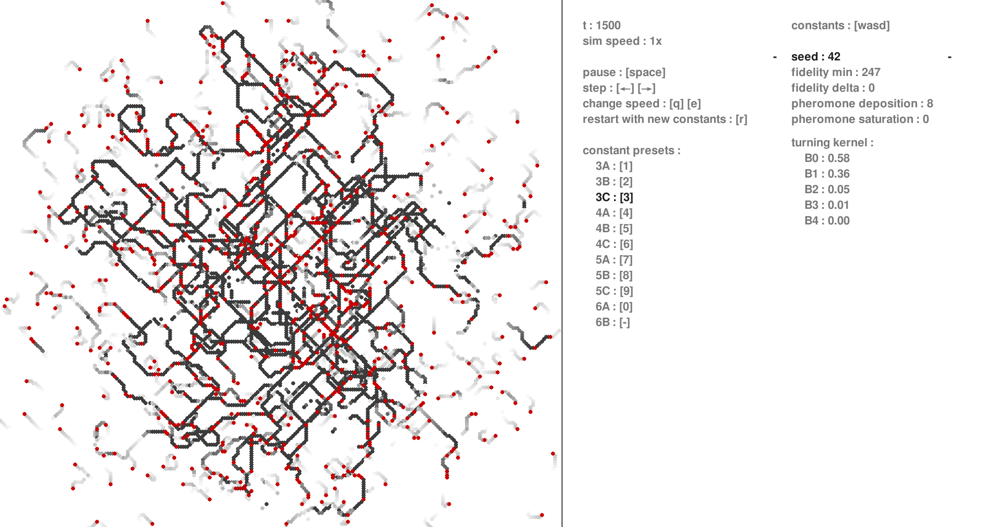
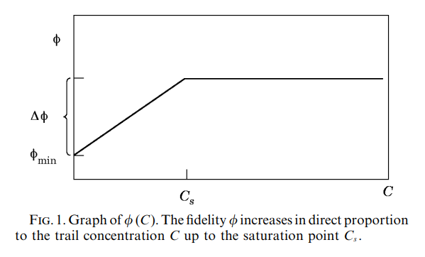

# Scientific Computing Project 1: Ants

Ant trail following simulation, reproducing results from the paper
[Modelling the Formation of Trail Networks by Foragin Ants (Watmough and Edelstein-Keshet, 1995)](https://personal.math.ubc.ca/~keshet/pubs/JamesAnts.pdf).



## Usage

The simulation can be run online
[here!](https://olincollege.github.io/scicomp-p1-il-ants/)

Alternatively, you can clone and run the code locally:

```bash
# Clone the repository
git clone https://github.com/olincollege/scicomp-p1-il-ants.git
cd scicomp-p1-il-ants

# Create virtual environment
python -m venv ants-venv

# Activate virtual environment
# Linux / macOS:
source ants-venv/bin/activate
# Windows:
ants-venv\Scripts\activate

# Install dependencies
pip install -r requirements.txt

# Run simulation
python main.py
```

## Constants

The simulation is depended on a set of constants, which can be modified using
the UI. Here is a brief description of each constant, further explanation can be
found in the [Algorithm Overview](#algorithm-overview) section.

- **seed**: Random seed for reproducibility.
- **fidelity min**: Minimum random chance (out of 256) for an ant to lose the
  trail it's following. See [Fidelity Function](#fidelity-function).
- **fidelity delta**: Maximum increase in fidelity based on pheromone
  concentration. See [Fidelity Function](#fidelity-function).
- **pheromone deposition**: Amount of pheromones deposited by each ant at each
  time step.
- **pheromone saturation**: Pheromone concentration at which fidelity reaches
  its maximum value. See [Fidelity Function](#fidelity-function).
- **turning kernel**: Probability distribution used to determine how an ant
  turns when it moves randomly. $B_n$ is the probability of turning
  $n \times 45°$. See [Turning Kernel](#turning-kernel).

## Algorithm Overview

### Ants

Ants are the main creatures of the simulation. Each ant is represented by a
position and a heading. The heading is one of 8 possible directions (N, NE, E,
SE, S, SW, W, NW).

### Main Simulation Loop

This simulation shows the trail formation of ants on a 256x256 grid world. As
ants traverse the world, they deposit pheromones that other ants can sense and
follow. The simulation performs the following steps at each time step:

1. A new ant is spawned in the center of world, facing a random diagonal
   direction.
2. Each ant deposits pheromones at their current location. The amount of
   pheromones deposited is determined by $\tau$, `pheromone_deposition`.
3. Each ant moves according to the **trail following algorithm** (explained
   below).
4. Ants that move out of bounds are removed from the simulation.
5. Pheromones everywhere evaporate by 1 unit.

### Trail Following Algorithm

Each ant senses pheromones in the spaces directly in front, 45° to the left, and
45° to the right of where it's facing. It moves according to the following
algorithm:

1. There is a random chance for the ant lose the trail it's following,
   determined by the **fidelity function** (explained below). If the ant loses
   the trail, it moves randomly according to the **turning kernel** (explained
   below).
2. If there are pheromones directly in front of the ant, it moves forward.
3. If there are pheromones to the left and right of the ant, it turns in the
   direction with more pheromones.
4. If there are equal amounts of pheromones to the left and right of the ant, it
   moves randomly according to the **turning kernel** (explained below).

### Fidelity Function

The fidelity function is used to determine the probability that an ant will lose
the trail it's following. It is a function of the amount of pheromones in the
ant's current location, $C$. The following constants are used in the fidelity
function:

- $\phi_{min}$: `fidelity_min`
- $\phi\Delta$: `fidelity_delta`
- $C_s$: `pheromone_saturation`

The fidelity function is defined as follows:




The ant has a $\frac{\phi(C)}{256}$ chance to lose the trail it's following.

### Turning Kernel

The turning kernel $B$, is a probability distribution used to determine how an
ant turns when it moves randomly. The turning kernel $B$, is a list of 5
numbers, $(B_0, B_1, B_2, B_3, B_4)$, where $B_n$ is the probability of turning
$n \times 45°$. After turning amount is determined, there is an equal chance of
turning left or right.

## Results
